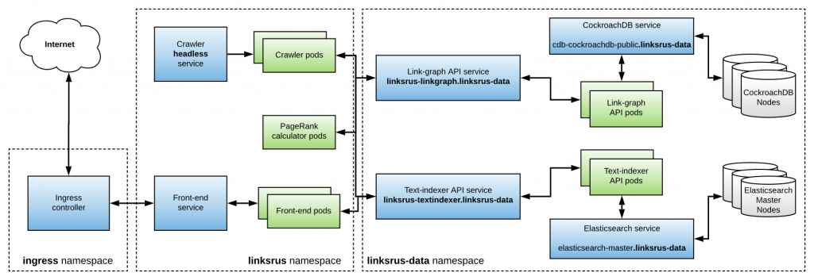

# Deploying the micro-service based version of Links 'R' Us on kubernetes

# Setting up a local kubernetes cluster 

Before you begin, make sure you have a working
[docker](https://www.docker.com/) installation on your machine as well as
access to a local kubernetes cluster. 

If you have already provisioned a local kubernetes cluster you can skip the
following set of instructions.

The examples that accompany this book are designed to work out of the box on a
[minikube](https://minikube.sigs.k8s.io/) cluster. Once you install the
minikube binary for your operating system, you can bring up a fully operational
cluster with all required addons (private registry and ingress) by running the
following command:

```
make bootstrap-minikube
```

## Configuring docker to use minikube's private registry

To use the private registry feature with docker, you need to update your docker
configuration and add minikube's docker registry to the list of **trusted insecure
registries**. Then, before proceeding make sure to restart your docker daemon
so it picks up the configuration changes.

Minikube's registry is exposed on minikube's IP at port `5000`. You can query
the IP assigned to minikube by running `minikube ip`. Then, if you are using Linux,
edit the `/etc/docker/daemon.json` file and add (or update) the following section
(substituting `$minikubeIP` with the output of `minikube ip`):

```json
{
  "insecure-registries" : [
    "$minikubeIP:5000"
  ]
}
```

On OSX and Windows you can right-click the docker icon, go to "**preferences**" and
then click on the "**Daemon**" tab to view the list of trusted registries.


Note that each time that you provision a minikube cluster, it will get a
**different** IP and the deploy commands from the next section will result in
docker errors such as: `http: server gave HTTP response to HTTPS client`. In
this case, you will need to re-configure your docker instance by repeating the
above steps. 

# Creating docker containers for the Links 'R' Us components used by this chapter

The [Makefile](Makefile) in this folder contains a handy target for creating
all required docker containers for the micro-service based version of the Links
'R' Us project and pushing them to the private registry exposed by minikube.
Simply run:

```console
make dockerize-and-push
```

The above make command builds:

- A helper container for applying the CockroachDB [schema](../../Chapter10/cdb-schema) for the link-graph database.
- The [front-end](../linksrus/frontend) service.
- The [crawler](../linksrus/crawler) service.
- The [PageRank calculator](../linksrus/pagerank) service.
- The [link-graph](../linksrus/linkgraph) service.
- The [text indexer](../linksrus/textindexer) service.

# Deploying the Links 'R' Us project to kubernetes

After building the required docker containers for this chapter, you can deploy
them to your local kubernetes cluster by running:

```console
make deploy
```

This command:

- Creates the required kubernetes namespaces
- Checks whether CockroachDB and Elasticsearch are already provisioned and provisions them otherwise using helm.
- Deploys all required containers (note that this chapter includes the **non-distributed**, single-pod version of the PageRank calculator).
- Exposes the front-end via an **ingress** on minikube's IP at port `80`.
- Sets up kubernetes [network policies](./08-net-policy.yaml) for preventing pods
  in the `linksrus` namespace from directly accessing the CockroachDB and Elasticsearch clusters.

After running the above command to completion, your local kubernetes cluster will 
be provisioned with the following resources:



## Accessing the front-end

To verify that the front-end is accessible you can use the following command:

```console
curl http://`minikube ip`
```

Then, point your web-browser at the above URL to access and interact with the 
front-end. Have fun!

## Cleaning up

There are actually two options at your disposal for cleaning up a deployment:

1) Remove the Links 'R' Us containers but **retain** the data stored on
CockroachDB/ElasticSearch. This option is recommended if you want to deploy
a Links 'R' Us version from one of the other chapters. This can be achieved by
running the following command: `kubectl delete namespace linksrus`.

2) Remove the Links 'R' Us containers and all data currently stored on
CockroachDB/Elasticsearch. This can be achieved by running the following command:
`make purge`.
